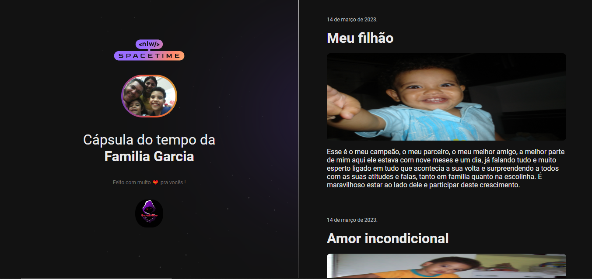

## Projeto 👨🏾‍💻 
Esse é um projeto web responsivo de uma cápsula do tempo para exibir memórias em uma linha do tempo.

## Tecnologias  🚀 
Este projeto foi desenvolvido durante o nlw da RocketSeat com as seguintes tecnologias:

- HTML 5
- CSS 3
- GIT
- GITHUB

## Layout 🏷️
Você pode visualizar o layout do projeto atrvés 
[Deste link](https://www.figma.com/file/xuZHetek0f9xPPvtdw46c3/C%C3%A1psula-do-tempo-%E2%80%A2-Trilha-Explorer-(Community)-(Copy)?type=design&node-id=306%3A3&t=kFaL0gwDaIMISFiV-1).
É necessário ter uma conta no [Figma](https://www.figma.com).
